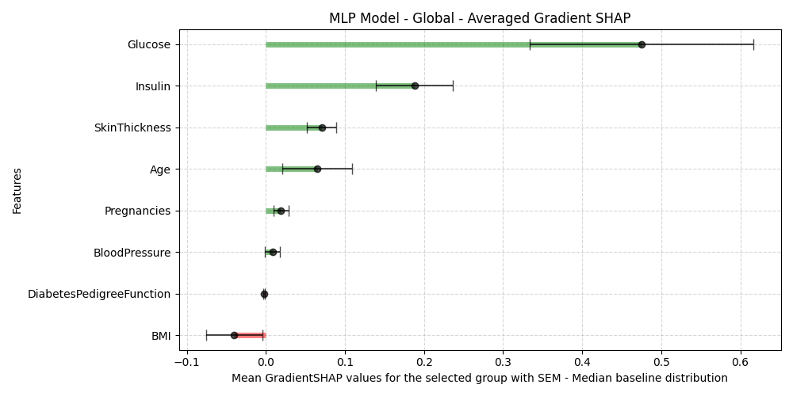

# Getting Started

## Environments setup

Currently FuzzCoCoPython is under developpment and will be soon available for Unix based systems (MacOS and Linux). For Windows user, we advise to use the [Windows Subsystem for Linux (WSL)](https://learn.microsoft.com/en-us/windows/wsl/install) which allows, among many things, to run Python and compile packages in a Linux environment while accessing your notebooks from Windows. 

To try these examples, clone [this GitHub repository](https://github.com/ThibaultSchowing/IMPTOX_XAI.git) or copy the desired files on your local machine and follow the instructions bellow. 


### Create virtual environments  

=== From scratch

    ```Python
    # 1 - Start WSL and
    # 2 - Create the virtual environments

    python -m venv .venvrf notebook numpy pandas matplotlib seaborn dimlpfidex kagglehub scikit-learn
    python -m venv .venvshap notebook numpy pandas matplotlib seaborn torch torchaudio torchvision kagglehub scikit-learn
    # - for fuzzy coco installation follow the next step bellow

```

=== From txt files

    ```Python
    # 1 - Start WSL and
    # 2 - Create the virtual environments from files

    python3 -m venv .venvNAME # Replace .venvNAME with the desired name
    source .venvNAME/bin/activate

    # 3 - Within your virtual environment, install from the given txt file. 
    python3 -m pip install -r requirements.txt

    ```


```Python
# 3 - Activate the desired environment (replace .venv by the created directory)

source .venv/bin/activate

# 4 - Start the Jupyter server on WSL. Specify a different port for each environment

jupyter notebook --no-browser --port 9898

```

---

### Environment for Fuzzy CoCo

Clone [this repository (NOT PUBLIC YET)](). 

```python

python -m venv .venvfuzzycoco notebook numpy pandas matplotlib seaborn 
source .venvfuzzycoco/bin/activate 

# from the repository folder
python -m pip install .

```

---


## Google Colab

The notebooks should be available on Colab soon.  

1. Random Forest and Fidex (TODO)
2. DIMPL Fidex (TODO)
3. FuzzyCoCo (TODO)
4. SHAP  (TODO)

---


## Usecase overviews (MOVE TO SPECIFIC PAGES)


=== "SHAP"

    SHAP illustrates how each feature contributes to the prediction by indicating whether it pushes the outcome higher or lower compared to the baseline. Positive SHAP values suggest an upward influence on the prediction, while negative values indicate a downward influence, providing a clear understanding of each feature's impact direction.

    Here we show the global impact of each feature averaged over all test samples:

    

    It is possible to analyse the variable for each test sample or group of samples, for instance all false negatives, to analyze which feature might influence the results: 

    

    
=== "DIMLP Fidex"

    ```py
    def main():
        print("Hello world!")

    if __name__ == "__main__":
        main()
    ```
=== "Fuzzy CoCo"

    ```py
    def main():
        print("Hello world!")

    if __name__ == "__main__":
        main()
    ```

