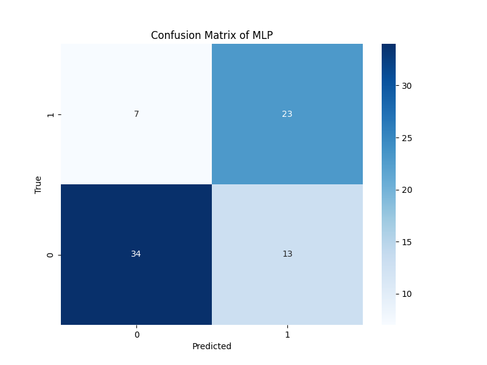
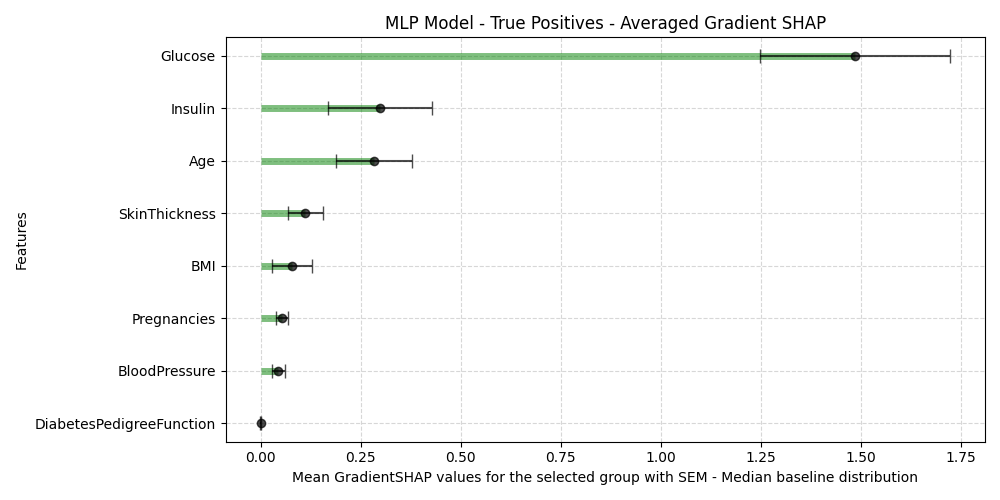
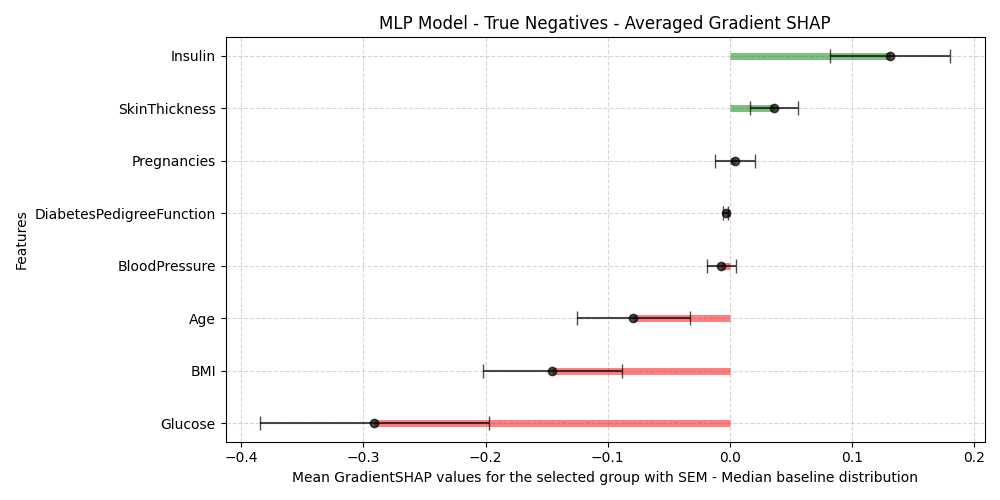
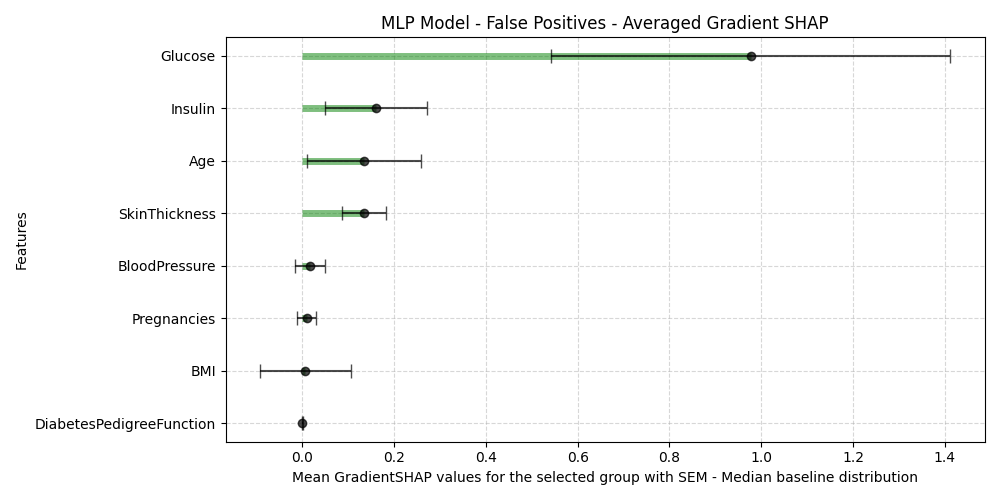

# Gradient SHAP


SHAP (SHapley Additive exPlanations) is a model-agnostic interpretability method based on cooperative game theory. 

!!! note "How does SHAP work ?"
    It assigns each feature in a model an importance value, which represents its contribution to a particular prediction. The method ensures fair and consistent allocation of importance scores by leveraging the properties of Shapley values, a well-established solution concept from cooperative game theory. One of SHAP's key advantages is its ability to explain complex, non-linear models by decomposing their predictions into additive contributions from individual features.

In this example, we use a simple Multi-Layer Perceptron (MLP) model to demonstrate SHAP's utility. However, SHAP and its variants, such as Gradient SHAP, are compatible with any type of machine learning model, including tree-based models, support vector machines, and neural networks of any architecture. GradientShap approximates SHAP values by computing the expectations of gradients by randomly sampling from the distribution of baselines/references, providing more stable explanations by leveraging multiple baseline distributions and backpropagation.

Our example demonstrate the explainability provided by Gradient SHAP, allowing us to identify the features that most contribute to model predictions in various scenarios, such as true positives, false positives, false negatives, and true negatives. The visualizations offer valuable insights into the decision-making process of the MLP and emphasize the importance of transparent AI models in complex problem domains. 


## Model architecture and results

=== "Model"
    Here we create a simple MLP with N_features input, one hidden layer of 64 neurons, and a single neuron output for the True/False result. 

    ```python

    class BinaryClassification(nn.Module):
        def __init__(self):
            super(BinaryClassification, self).__init__()
            # Number of input features is MLP_INPUT_SIZE.
            self.layer_1 = nn.Linear(MLP_INPUT_SIZE, 64) 
            self.layer_2 = nn.Linear(64, 64)
            self.layer_out = nn.Linear(64, 1) 
            self.relu = nn.ReLU()
            self.batchnorm1 = nn.BatchNorm1d(64)
            self.batchnorm2 = nn.BatchNorm1d(64)
            self.dropout = nn.Dropout(p=0.5)  # Randomly zero out neurons to avoid overfitting

            
        def forward(self, inputs):
            x = self.relu(self.layer_1(inputs))
            x = self.batchnorm1(x)
            x = self.relu(self.layer_2(x))
            x = self.batchnorm2(x)
            x = self.dropout(x)
            x = self.layer_out(x)
            
            return x

    ```

=== "Results"
    The prediction results are shown in the confusion matrix bellow. Here we have a **71% test accuracy**, as good as these results may be, we do not have any explanation on why these decisions were made, as neural networks are black box models. 

    


## Model training, results and explanations

We applied **Gradient SHAP** to the testing data by generating feature attributions for each individual sample. For every sample, the input features are perturbed using baseline references, and the corresponding changes in the model's output are analyzed. This process captures the contribution of each feature to the prediction.

To derive meaningful insights at the group level, we aggregated the feature attributions across all samples grouped by True Positives, True Negatives, False Positives and False Negatives. This allowed us to summarize the overall influence of each feature on the model's predictions. The resulting visualizations, as shown in the figures below, highlight the averaged feature contributions along with confidence intervals, providing a clear and interpretable representation of the model's decision-making patterns.

=== "True Positives"
    

=== "True Negatives"
    

=== "False Positives"
    

=== "False Negatives"
    

## Global explanations

Here we can have an insight on which feature drives the result toward a positive or negative prediction within the different result groups. This tells us for instance that the Glucose level is a powerful feature for the True Positive and True Negatives groups but it also drives falso positive results toward a positive prediction. We could conclude that glucose alone is a powerful predictor but is unstable. We can average the SHAP values and look at the global variable influence to get a broader view on the variables influences.


You can find the notebook in the GitHub repository by clicking the link in the top-right corner. 