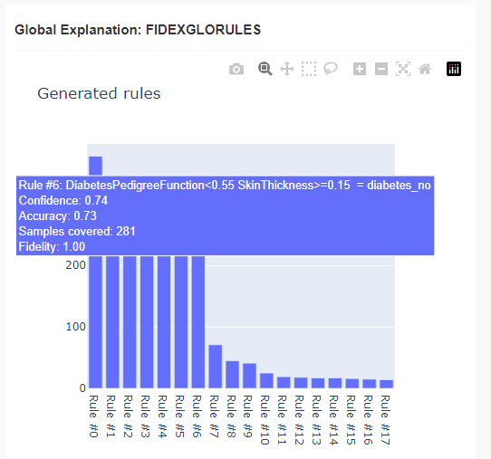

# DIMLP Fidex

The [DIMLP-Fidex](https://hes-xplain.github.io/documentation/dimlpfidex/overview/) framework is made from [DIMLP](https://hes-xplain.github.io/documentation/dimlpfidex/dimlp/overview/), à speclalized feed-forsward neural network architecture derived from the traditional MLP (Multi Layer Perceptron) and from the [FIDEX](https://hes-xplain.github.io/documentation/dimlpfidex/fidex/overview/) algorithm itself focuses on extracting local rules to explain the predictions of a pre-trained model for given data samples. Each of the other algorithms builds upon this foundation to offer additional functionalities.

## Results and rules

After the results are computed, the FIDEX algorithm computes local and global **interpretable** rules and displays them with the OmniXAI dashboard as shown bellow. 

=== "Results"
    
    With the basic parameters, we obtain a 62% test accuracy.

=== "Local"
    

=== "Global"
    

You can find the notebook in the GitHub repository by clicking the link in the top-right corner. 