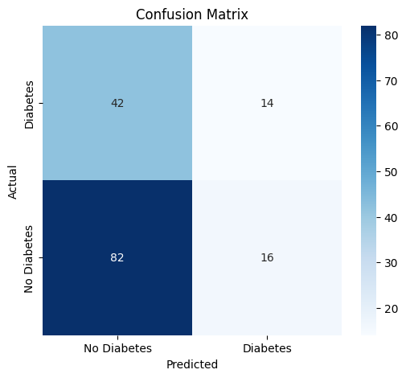
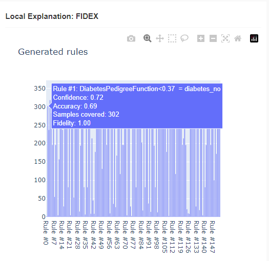

# DIMLP Fidex

The [DIMLP-Fidex](https://hes-xplain.github.io/documentation/dimlpfidex/overview/) framework is made from [DIMLP](https://hes-xplain.github.io/documentation/dimlpfidex/dimlp/overview/), à speclalized feed-forsward neural network architecture derived from the traditional MLP (Multi Layer Perceptron) and from the [FIDEX](https://hes-xplain.github.io/documentation/dimlpfidex/fidex/overview/) algorithm itself focuses on extracting local rules to explain the predictions of a pre-trained model for given data samples. Each of the other algorithms builds upon this foundation to offer additional functionalities.

## Results

=== "Local"
    
    

=== "Global"
    

asdf