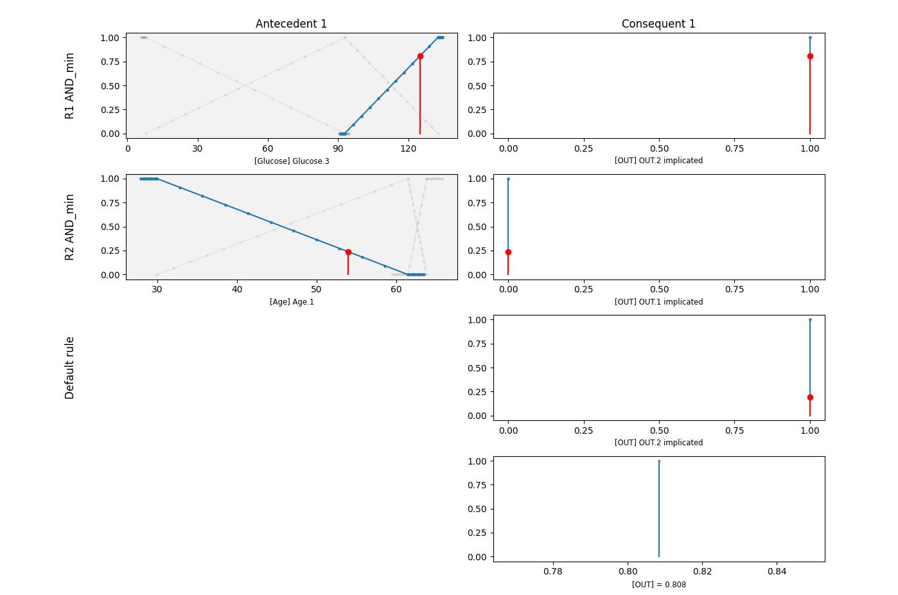

# Fuzzy Coco

Fuzzy CoCo is an algorithm that uses Fuzzy logic, a human readable way of creating variable and rules, and CoCo that stands for Coevolutionary Computation. You can find details in [this paper](https://infoscience.epfl.ch/entities/publication/d86c7dde-72fa-4fb7-9842-2c3ca0e1a1b3) or bellow is an as short as possible summary of how Fuzzy CoCo works.

??? note "Fuzzy Logic and Co-evolutionary computation"

    Fuzzy logic is an extension of classical logic that deals with reasoning in uncertain or imprecise environments. Unlike traditional binary logic, where variables must be strictly true (1) or false (0), fuzzy logic allows for degrees of truth between 0 and 1.  

    ### **Fuzzy Variables**  
    Fuzzy variables represent real-world concepts that lack precise boundaries. For example, in a medical setting, "fever" is not just "present" or "absent"—a temperature of 37.5°C is slightly feverish, while 39°C is definitely high. Fuzzy variables can take on a range of values with different degrees of membership in categories like "low," "medium," and "high."

    ### **Membership Functions**  
    A membership function defines how a fuzzy variable is mapped to a degree of belonging within a category. It assigns a value between 0 and 1 to indicate how strongly a given input belongs to a specific fuzzy set. For example, a temperature of 37.5°C might have a membership of 0.3 in the "high fever" category and 0.7 in the "mild fever" category. These functions can take different shapes, such as triangular, trapezoidal, or Gaussian, depending on the level of smoothness desired.

    ### **Fuzzy Rules**  
    Fuzzy rules describe the relationships between fuzzy variables using "if-then" statements. These rules help make decisions based on imprecise input. With our model from the PIMA dataset we obtain the following:  

    !!! hint ""
        - **IF** (Glucose is Glucose.3), **THEN** (OUT is OUT.2)
        - **IF** (Age is Age.1), **THEN** (OUT is OUT.1)] 
        - **ELSE** (OUT is OUT.2)

    Rules generated are human readable and matched with linguistic variables. This gives results as bellow with Variable.1, Variable.2 and Variable.3 corresponding to the number of sets selected (e.g. it could linguistically correspond to Small, Medium and Large)

    Currently, function are being implemented to visualize the training progress as well as the resulting fuzzy model. For a test sample, the fuzzyfication looks like this:

       

    These rules allow for flexible, human-like reasoning, making fuzzy logic useful in decision support systems, medical diagnostics, and control systems.  

    ### Fuzzy CoCo

    To find the right values, e.g. where are the cutoffs for a variable to be small, medium or large, and to find the rules, FUGE uses Co-evolutionary Computation. Co-evolutionary computation is an extension of evolutionary algorithms (EAs) where multiple interacting populations evolve simultaneously. Instead of a single population optimizing in isolation, co-evolution involves different groups influencing each other's evolution, leading to more dynamic and adaptive solutions.

!!! abstract "Work In Progress"

    Over the past decade, FUGE, the software implementing Fuzzy CoCo, has undergone sporadic updates and been used by various users, resulting in multiple unmatched and gradually outdated versions. Recently, its GUI was removed, and the codebase was cleaned to facilitate integration into a Python package. The integration is still in progress, and the current version allows only model creation, prediction and a few beta visualization functions. Rule extraction, training process visualization, and additional features will be improved and available soon. Stay tuned!

