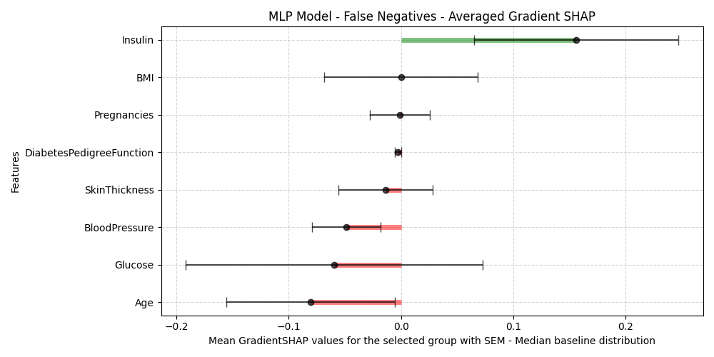

# Home

These pages aim to guide IMPTOX members in creating and interpreting models for tabular numerical data. The shown sample workflows assume fully numeric datasets, including ordinal categories or one-hot encodings, and focuses on predicting a target variable (classification or regression). To illustrate these methods, we will apply XAI techniques to well-known example datasets such as the [Pima Indians Diabetes Database](https://www.kaggle.com/datasets/uciml/pima-indians-diabetes-database) and the [Heart Disease Dataset](https://www.kaggle.com/datasets/johnsmith88/heart-disease-dataset).


## The project

!!! example "IMPTOX Project"

    Microplastics and nanoplastics (MNP) are a growing concern for human health and the environment. The **IMPTOX** project brings together scientists from diverse fields—chemistry, biology, and medicine to investigate this pressing issue. Whether you're measuring MNP in environmental or animal samples, studying their impact on biofilms, tracking them as pathogen carriers, or exploring medical effects such as allergies, **the project generates a wealth of complex and valuable data**.

    Data is only the beginning. How do we extract meaningful insights or create prediction models from high dimentional and complex data? This is where machine learning (ML) and Explainable Artificial Intelligence (XAI) come into play. XAI helps transform data into knowledge by offering transparent and interpretable models that reveal the why behind predictions.

## What is machine learning and how can it help?

??? note "Why machine learning?"
    While traditional statistical analysis excels at accurately describing data and identifying patterns, machine learning algorithms offer the ability to explore more complex and high-dimensional datasets. These advanced methods can capture intricate relationships and non-linear interactions that classic techniques might overlook.  Moreover, machine learning models have the potential to deliver more accurate predictions by learning from complex data interactions. 

??? note "How machine learning could help with your research?"

    Machine learning allows you to go beyond observations, transforming data into predictions and new hypotheses. With XAI methods, these predictions become understandable and scientifically valuable, allowing to eliminate unused variables and focus on important ones, opening doors to optimized research paths. 

    - **Environmental Insights:** Could patterns in environmental data reveal which microplastic types are present or how they are distributed across ecosystems? 
    - **Pathogen Risks:** Can we uncover hidden relationships between microplastic chemical properties and their role in fostering pathogen growth? 
    - **Health Predictions:** Is it possible to predict health outcomes, such as allergic responses, based on exposure to microplastics combined with patient genotype ? 

??? note "The different types of XAI"

    TODO - ABE

    {==Highlighting==}

## Expected explainable results

Here is an extract of the type of result you can get with the methods explored here.

=== "SHAP"

    

    
=== "DIMLP Fidex"

    

=== "Random Forest"
    Global rules overview
    ```
    Number of rules : 152, mean sample covering number per rule : 11.572368, mean number of antecedents per rule : 3.085526
    No decision threshold is used.

    Rule 1: Glucose<104.5 BMI<28.8 -> class 0
    Train Covering size : 81
    Train Fidelity : 1
    Train Accuracy : 1
    Train Confidence : 0.980741
    ```

=== "Fuzzy CoCo"

    ```
    Rules generated are human readable and matched with linguistic variables. This gives results like: 

    - **IF** temperature is "high" **THEN** risk of infection is "high"  
    - **IF** heart rate is "moderate" **AND** temperature is "mild" **THEN** risk of infection is "medium"  

    ```

---